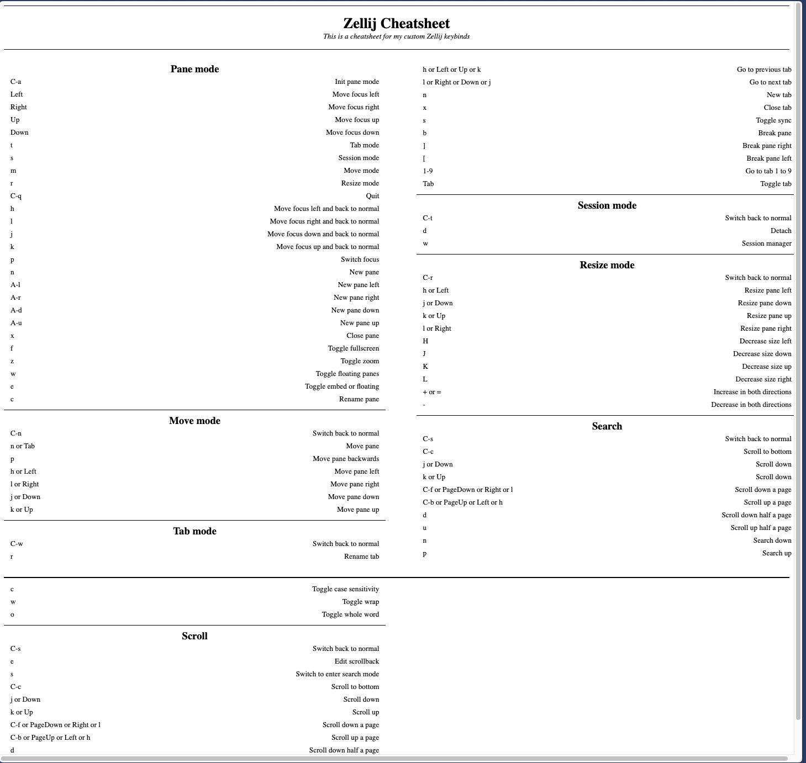
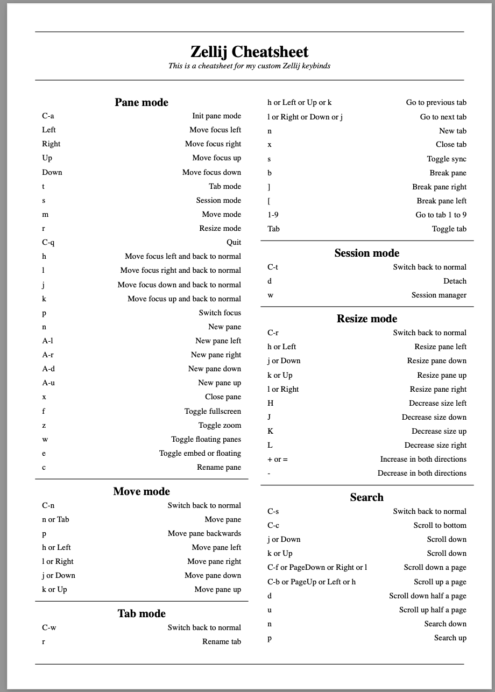
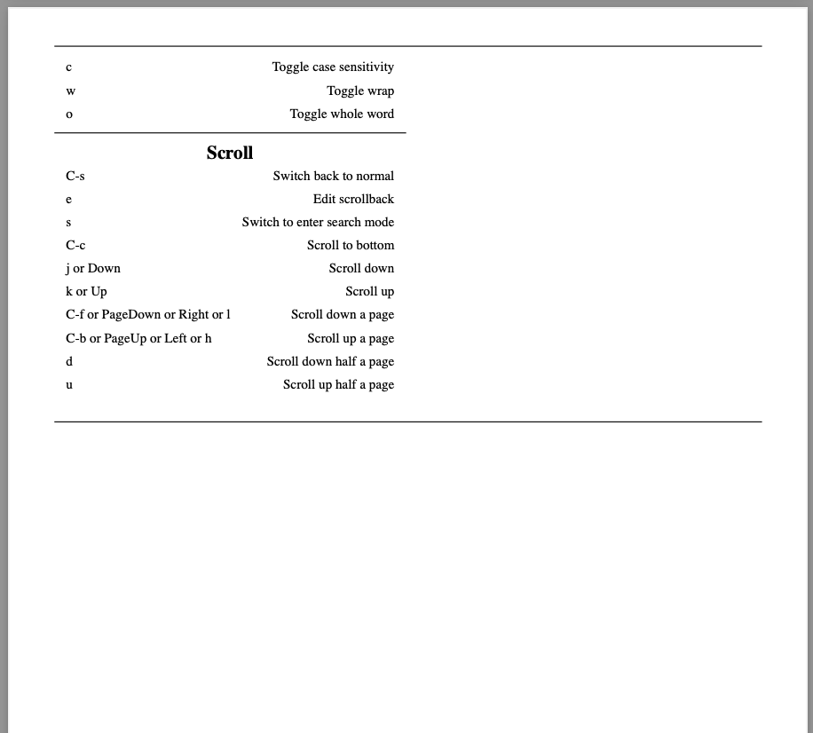

# Cheat my Sheet!

A _very_ printable cheatsheet generator!

## What?

This is a simple tool that allows you to generate an cheat sheet of anything
you need in a very printable fashion. Simply define a yaml file with the data
you want to generate a cheat sheet from and let the tool do the magic to create
a nicely formatted HTML file that - when printed - ensures that the columns are
sanely layed out on the page as you expect them to be for maximum readibility.
Moreover it ensure that the sections are not awkwardly broken - no longer a
section title at the end of previous page, leaving you without any context on
the other!

## How?

The tool consists of a dead simple program written in Go that takes the HTML
template and fills it with the data from provided YAML file. Then the
not-so-dead-simple JS code (conveniently included in the HTML template) takes
the generated template and does all kind of calculations and modifications to
the document structure to make all those printability assurences.

### Usage

To generate your cheatsheet simply call:

```bash
go run . -i input.yaml -o output.html -t template_name
```

_Note:_ `-t` can be skipped, it will default to the only bundled template:
_printable_.

### Input format

```yaml
title: "My Cheatsheet"
description: "This is my cool cheatsheet!"

sections:
  - title: "Section 1"
    items:
      - term: "Ctrl + a"
        description: "Select all"
  .
  .
  .
```

You can also check out the more comprehensive example in
`examples/zellij-keymap.yaml`

### Creating templates

Please consult the default `templates/printable.html` to see how the template is
built. You can easily create your own or extend the existing template to you
liking since it's using plain HTML and CSS. JS code included in the default
template should be able to handle the printability regardless of your styles
since it measures the heights of the already rendered elements. You can also
build something completely your own to suite your needs, the output will be an
HTML file you can later include on your own website or do literally whatever you
want.

## Why?

I was rebuilding some of my configurations and created way too many keybidings
to remember them staright away and opening the configs to peek _"What the hell
did I bind it to?"_ annoyed me really quick. I looked for a tool to help me
easily generate a cheatsheet for myself to print out and take a look when I need
it, but couldn't find anything. Because of the fact that such cheatsheets are
usually short-lived for me, I didn't want to spend too much time in Google Docs
or MS Word making sure everything is aligned, so I decided to spend even more
time (but only once!) to build my own solution for my own problem. So I spent a
couple hours one weekend to spit out some code and this is the result. I'm quite
happy with how it turned out so decided to share.

## Examples 

Here's how the generated HTML file renders in browser: <br/>

<br/>
And here's the print preview: <br/>


